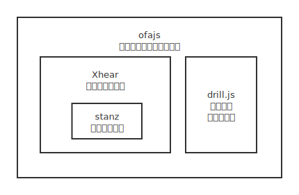

# 关于ofajs

## ofajs 会不会停止维护？

开发 ofajs，主要是为了自己用的爽；作为框架开发者，自己也在使用这个框架，来做其他工具类产品；只要还能写代码，就会一直维护下去；

ofajs的开发和维护，也有很长时间了；

虽然 ofajs 的仓库是从 [2019年5月](https://github.com/kirakiray/ofa.js/commits/master?after=6430cf81183be2bf556227d872b0ac13e6dd13b3+209&branch=master)开始创建的，但它的前身是 [Xhear](https://github.com/kirakiray/Xhear) + [drill.js](https://github.com/kirakiray/drill.js) 组合拳在2018年已经投入实战；

> [drill.js](https://github.com/kirakiray/drill.js/commits/master?after=a0b907ff01fe443420b8272c37b295ebff7c5854+104&branch=master) 虽然是在2017年立项，但是它的前身还能追溯2015年；

## ofajs的组成

ofajs 以 [Xhear](https://github.com/kirakiray/Xhear) 和 [drill.js](https://github.com/kirakiray/drill.js) 为基础，给组件注册提供语法糖，添加了页面组件、应用组件、路由和微前端方案，形成一套自主的开发流程；

#### ofajs的框架构成图示

内部库的介绍:

#### Xhear

以 [原生组件](https://developer.mozilla.org/zh-CN/docs/Web/Web_Components) 和 [stanz](https://github.com/kirakiray/stanz) 为基础，在模板上添加 MVVM 功能，DOM上添加语法糖，数据上添加数据同步功能，让开发[原生组件]((https://developer.mozilla.org/zh-CN/docs/Web/Web_Components))变得非常简单；

#### stanz

功能强大的数据同步库，用最少的代码管理数据状态；

#### drill.js

运行于浏览器端的**纯异步**资源管理库，包含模块化、多功能模块、自定义文件封装和请求调配等功能；

## 单元测试

    

        <a href="https://kirakiray.github.io/ofa.js/test/test.html">ofajs单元测试</a>
        <iframe src="https://kirakiray.github.io/ofa.js/test/test.html" style="flex:1;"></iframe>
    

    

        <a href="https://kirakiray.github.io/Xhear/test/test.html">Xhear单元测试</a>
        <iframe src="https://kirakiray.github.io/Xhear/test/test.html" style="flex:1;"></iframe>
    

    

        <a href="https://kirakiray.github.io/drill.js/test/test.html">drill.js单元测试</a>
        <iframe src="https://kirakiray.github.io/drill.js/test/test.html" style="flex:1;"></iframe>
    

    

        <a href="https://kirakiray.github.io/stanz/test/test.html">stanz单元测试</a>
        <iframe src="https://kirakiray.github.io/stanz/test/test.html" style="flex:1;"></iframe>
    

## ofajs 的代码质量

虽然 [ofajs](https://cdn.jsdelivr.net/gh/kirakiray/ofa.js/dist/ofa.min.js) 功能强大，但代码非常精简，压缩混淆后只有[41kb](https://kirakiray.github.io/ofa.js/dist/ofa.min.js)（16KB min+gzip），