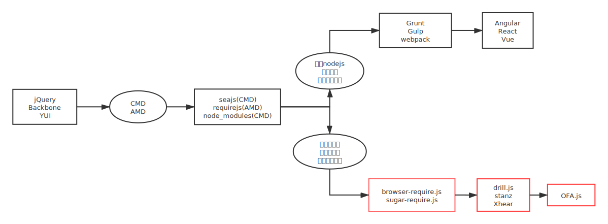
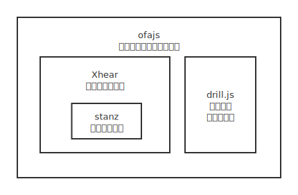

# 为什么要开发ofajs？

主要有一下几个原因：

- 主要原因，现在的前端框架不够好用；
    > 至少不适合作者开发工具类应用
- 不喜欢现有的主流数据同步方案；
- 讨厌webpack；

经过多年的开发经验，发现现有框架有几个严重的问题（作者认为）：

- 有很重的中间层，开发流程必须经过 **nodejs + webpack** ，学习成本高，调试困难（sourcemap debug问题多）；
    > 这让简单的项目变得复杂；例如后端程序员制作一个简单的页面，按现在(2021)的流行框架，就必须面临 `nodejs` -> `npm`-> `webpack` -> `vue/angular/react` 的学习成本，你说当年用 `jQuery` 不香吗？
- 编译时间随着项目的增大而变长，导致项目后期开发花费大量时间预编译（查看效果），没有利用浏览器对js即时运行的优势；
- 现有前端框架很难跳出当前的固化思维，要想拓展分布式应用、微前端等等方向，难度极高；

作者觉得有方法避开nodejs和webpack来管理前端资源，所以着手开发了ofajs。

ofajs 核心基于 web components 开发，并集成模块化，组件化、数据同步和微前端等方案；

- 不需要打包编译（对比当前主流前端开发框架，不需要学习nodejs,npm,webpack），修改后刷新就能查看效果；
- 直接上手就可以开发的框架，回到 jQuery 时代的开发模式；
- 能支撑超大型项目的开发；（**超大** 的定义没有行业标准，作者认为大概等于操作系统的GUI XX UI 级别的难度）
- 完美贴近原生开发，能使用原生组件化的所有api（:part()等等伪选择器），完全发挥css优势（纯净的scope style，可动态修改组件内的style文本）；

ofajs 的目标，是尽量把浏览器当做生态主体，在这个应用层（浏览器）上构建系统；

<!-- ## 前端开发没有了中间层的好处？ -->
## web前端开发去掉中间层(nodejs+webpack)后的实践

没有中间层（nodejs+webpack/grunt/glup...）后，更好的利用浏览器的特性（即时运行），不会出现sourcemap的幽灵断点等问题；

> **幽灵断点**：打不了断点或打了断点无效；断点内容跟实际内容不一致；输出打印无效等问题；

> 现有前端框架调试使用sourcemap或多或少有问题；不是说sourcemap不好，而是它很难驾驭；

单独调试组件就不需要重新搭建脚手架，也没有编译流程，大幅降低代码调试时间，开发人员就更愿意编写使用案例（作者认为而已）；

更容易解耦，更易编写不耦合的代码，屎山代码几率降低；（这跟人也有很大关系）

因为独立组件的开发和运行成本降低，以至于框架本身的辅助性工具，都能以组件或应用的形式进行开发；（就是说可以用ofajs来开发提升ofajs开发效率的工具，当前文档型网站也是案例之一）

没有了无用的 nodejs + webpack 流程，入门成本也大幅降低，更聚焦前端开发业务本身；

> **无用** 仅对业务而言，nodejs + webpack 只是开发的媒介；**大幅降低** 也仅针对当前三大框架而言；

`nodejs + webpack` 这道门槛，导致在 javascript 投入过多精力，css知识得不到重视；很多有潜力的css开发也因此被劝退；要开发一个好的组件，需要css和js融会贯通；

> 现在招前端开发者，让他们将一行javscript代码结果展示到页面上，他们会新建一个vue/react/angular项目来执行，也是因为这套组合拳荼毒太深（大误XD）；

微前端方案变得简单；使用ofajs从组件、页面到应用都可被独立使用；

> **微前端** 是一种类似于微服务的架构，它将微服务的理念应用于浏览器端，即将 Web 应用由单一的单体应用转变为多个小型前端应用聚合为一的应用。各个前端应用可以独立运行、独立开发、独立部署。 ---摘自某书

封装层更加简单后，才能有更多精力摸索 webgl、wasm、语音视频图片、svg等等

其他引用

> Webpack 这种工具，如果要深入，完全可以写出一部魔法书来。但是从聚焦业务角度，这意义不大。所以说前端目前很多现状导致关注点分散，到达山顶的路径太多，也徒耗精力。 ---摘自某金app用户

> 天下苦 webpack 久已

## ofajs适合什么类型的项目？

ofajs 开发之初是想做 **银弹型前端框架**；

> 银弹型，就是适合所有类型的前端项目；

适合互联网属性比较强的前端产品；用户要懂得升级或更换浏览器；

> ofajs需要较新的浏览器才能运行；

现已确认适合开发 **工具类** 的应用；

很适合 **新手** 或 **浅前端开发** 使用；

> 新手在摸索期内没有 nodejs/npm/webpack 这几座大山，直接进入组件的理解和开发流程；熟悉后可自行选择框架深入学习，因为组件化思维基本相通；

> **浅前端开发** ：想开发一些简单的前端项目，又没有深入学习web前端开发意向的人；

它的特性适合开发大型应用，例如中台系统前端、工具类应用、后台管理系统等等；

### 不适合使用ofajs的项目

不适合 **需要兼容低版本浏览器** 的项目； **不支持IE浏览器**；

ofajs的运行需要支持 [Web Components](https://developer.mozilla.org/zh-CN/docs/Web/Web_Components) 特性的浏览器；支持该特性的浏览器版本如下：

| 浏览器名称 | 版本 | 对应版本时间 |
| :-----| ----: | :----: |
| Chrome | ≥55 | 2016-12 |
| Safari | ≥11 | 2017-09 |
| Firefox | ≥63 | 2018-10 |
| Edge | ≥79 | 2020-01 |

目前微信安卓版webview已支持ofajs；具体支持到最低版本有待用户反馈；

## ofajs 为什么和现在前端框架大有不同？
<!-- ## ofajs的开发历史 -->
在web前端发展史中，模块化方案曾有争议，分别是AMD和CMD方案；历史长河最终选择了CMD，才有了现在的前端开发生态（Nodejs -> Grunt/Glup/Webpack -> Bubble/TypeScript -> Angular/React/Vue）；

> [CMD](https://github.com/cmdjs/specification/blob/master/draft/module.md) 是 "Common Module Definition" 的缩写，意思是 "通用模块定义"；代表有 Nodejs模块化系统，`Seajs`；

> [AMD](https://github.com/amdjs/amdjs-api/wiki/AMD) 是"Asynchronous Module Definition"的缩写，意思是"异步模块定义"；代表有 `requirejs`；

ofajs 选择了**类AMD** 的方案；所以开发功能时，API设计会更贴近原生；和CMD背道而驰，越走越远；

> ofajs的模块化方案（`drill.js`）其实是同时汲取了CMD和AMD的特点，既满足异步并行加载，又满足顺序按需解析执行；但本源更接近AMD；

## ofajs的组成

ofajs是在 [Xhear](https://github.com/kirakiray/Xhear) 和 [drill.js](https://github.com/kirakiray/drill.js) 的基础上开发的；Xhear是前端组件化核心逻辑，drill负责资源管理；大致如图；

<!-- ## ofajs和现有前端框架相同的地方

- MVVM
- 模板渲染
- 模块化
- 组件化
- 数据同步
- 路由

## ofajs 特色功能

- 微前端
- 页面标签（一个标签引用页面，参考小程序）
- app标签（一个标签引用app，参考小程序）

开发ofajs之初，就想方设法让每个api都简单易用； -->